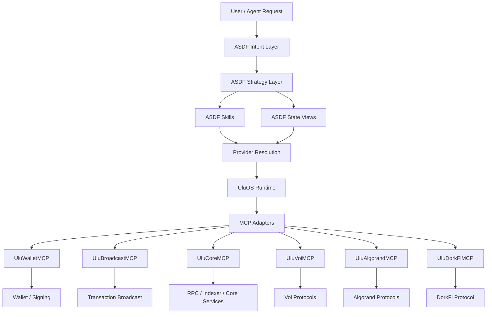

# ASDF — Agent Skill Discovery Format

ASDF is an open standard for **agent-readable repositories**, **portable skill definitions**, and **deterministic automation workflows**.

It provides a unified format that allows AI agents to discover project context, invoke typed actions, query structured state, and execute multi-step strategies through runtime adapters such as MCP.

## The Problem

Agent frameworks today rely on fragmented repository conventions — `.cursorrules`, `CLAUDE.md`, `AGENTS.md`, `CONTRIBUTING.md` — each with different formats and no shared semantics. There is no standard way to define portable skills, compose deterministic workflows, or resolve execution across runtimes.

ASDF replaces this fragmentation with a **single canonical file**:

```
ASDF.md
```

Compatibility shims are generated so existing tools continue to work, but `ASDF.md` is the source of truth.

## What ASDF Enables

- **Agent discovery** — a single canonical context file per repository
- **Portable skill definitions** — typed actions with `asdf://` URIs
- **State views** — structured, read-only queries for runtime data
- **Deterministic strategy DSL** — ordered workflows composing skills and views
- **Provider abstraction** — logical providers decoupled from runtime implementations
- **Runtime execution** — adapters for MCP, APIs, plugins, and simulations

## Architecture

```
Strategy
   ↓
Skills + State Views
   ↓
Provider Resolution
   ↓
Runtime Adapter
   ↓
Execution Backend (MCP / API / Plugin)
```

## Core Concepts

| Concept | Purpose |
|---------|---------|
| Skill | Action an agent can perform |
| State View | Read-only query for structured data |
| Strategy | Deterministic multi-step workflow |
| Provider | Logical protocol or service reference |
| Runtime Adapter | Concrete execution backend (e.g. MCP) |
| Capability | Permission required to execute a skill or view |

---

## Layered Architecture

ASDF, UluOS, and MCP are complementary layers in a unified agent execution stack.

| Layer | Role |
|-------|------|
| ASDF Intents | What the user wants |
| ASDF Strategies | How to do it |
| ASDF Skills / Views | Atomic capabilities |
| Providers | Logical routing |
| UluOS | Runtime / kernel |
| MCPs | Drivers |
| Protocols / Chains | External systems |

**ASDF** defines the capability language and strategy model.
**UluOS** provides the runtime execution environment.
**MCP** provides concrete execution interfaces.

```
ASDF = language
UluOS = runtime
MCP = drivers
```

### Stack



### Layers

**Users / Agents** — Where requests originate. These may be humans, applications, or autonomous agents.

**Intent Layer** — High-level goals expressed using ASDF intents (ASDF-0012).

**Strategy Layer** — Deterministic workflows that convert intents into executable steps (ASDF-0006).

**Skill + View Layer** — Capabilities used by strategies. Skills perform actions (ASDF-0007). Views retrieve read-only state (ASDF-0011).

**Provider Resolution Layer** — Maps logical providers to concrete implementations (ASDF-0010).

**Runtime Adapter Layer** — Translates ASDF constructs into executable backends. UluOS serves as the runtime kernel.

**MCP Layer** — Concrete execution interfaces such as UluWalletMCP, UluBroadcastMCP, UluCoreMCP, UluVoiMCP, UluAlgorandMCP, and UluDorkFiMCP.

**Protocol / Chain / Service Backends** — Actual systems being interacted with: blockchains, smart contracts, APIs, and services.

### Example Execution

```
"Maintain my DorkFi position health"
  → asdf://intent/defi/maintain_health
  → maintain_health.strategy
  → views + skills
  → provider resolution
  → UluOS runtime
  → UluDorkFiMCP / UluWalletMCP / UluBroadcastMCP
  → on-chain execution
```

---

## Specifications

| Spec | Title | Status |
|------|-------|--------|
| ASDF-0001 | Agent Skill Discovery Format | Accepted |
| ASDF-0002 | Portable Skill References | Accepted |
| ASDF-0003 | Metadata Format | Accepted |
| ASDF-0006 | Strategy DSL | Accepted |
| ASDF-0007 | Skill Interface Definition | Accepted |
| ASDF-0008 | Skill Capability Model | Accepted |
| ASDF-0009 | MCP Binding Specification | Accepted |
| ASDF-0010 | Provider Resolution | Accepted |
| ASDF-0011 | State View Specification | Accepted |
| ASDF-0012 | Intent Specification | Draft |
| ASDF-0013 | Registry Specification | Draft |
| ASDF-0014 | Capability Authority Resolution | Draft |
| ASDF-0015 | Stream Composition and Pipe Semantics | Draft |
| ASDF-0016 | Managed Resource Model | Draft |
| ASDF-0017 | Execution Trace Model | Draft |
| ASDF-0018 | Runtime Specification | Draft |

---

## Specification Process

ASDF specifications follow a lifecycle similar to RFCs and EIPs.

```
Draft → Review → Accepted → Final
```

New proposals begin as Draft specifications. See `specs/PROCESS.md` for details.

---

## Compatibility

This repository uses `ASDF.md` as the canonical agent-readable project context file.

To support existing agent frameworks, lightweight compatibility files are included at the repository root, such as `.cursorrules`, `CLAUDE.md`, `AGENTS.md`, and `CONTRIBUTING.md`.

These files are adapters only and point back to `ASDF.md` as the source of truth.

---

## Cursor Compatibility

This repository includes native support for Cursor agent discovery.

Cursor will automatically load rules from:

`.cursor/rules`

The rules file directs Cursor agents to `ASDF.md`, which serves as the canonical agent-readable repository context.

---

## CLI

The `asdf` CLI provides tooling for working with ASDF repositories.

### Install

```
npm install
npm run build
```

### `asdf init`

Scaffold an ASDF-ready repository structure:

```
npx asdf init
```

This generates:

| File | Purpose |
|------|---------|
| `ASDF.md` | Canonical agent-readable project context |
| `.cursorrules` | Cursor compatibility (legacy) |
| `.cursor/rules` | Cursor compatibility (modern) |
| `CLAUDE.md` | Claude Code compatibility |
| `AGENTS.md` | OpenClaw / Codex compatibility |
| `CONTRIBUTING.md` | Contributor and Copilot Workspace compatibility |
| `examples/hello.strategy` | Example strategy file |
| `examples/example.ASDF.md` | Example ASDF context file |
| `specs/` | Directory for specification documents |
| `examples/` | Directory for examples |

Options:

| Flag | Description |
|------|-------------|
| `--name <name>` | Project name for templates (default: directory name) |
| `--force` | Overwrite existing files |
| `--help` | Show help |

Existing files are preserved unless `--force` is passed.

---

## Prompt Library

This repository includes a library of reusable prompts for applying ASDF in real projects using Cursor, Claude Code, and OpenClaw.

The prompts are reference tooling — structured markdown files with clear goals, tasks, constraints, and expected output. They live under `prompts/` and are organized by agent framework:

- `prompts/cursor/` — scaffolding, skill creation, strategy authoring, MCP binding
- `prompts/claude/` — agent context templates
- `prompts/openclaw/` — skill generation

See `prompts/README.md` for the full index.