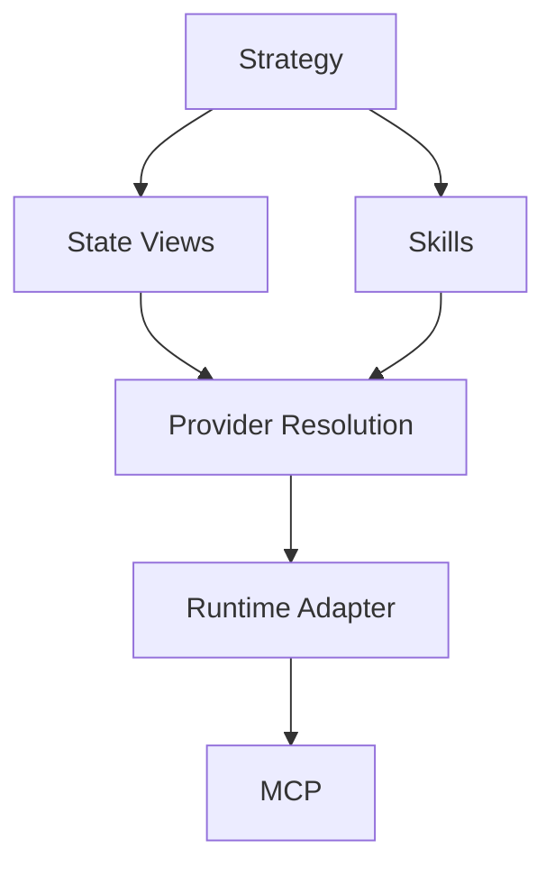

# ASDF‑0011
State View Specification

## Purpose

Defines a standard way for ASDF strategies to read structured, typed, read-only state from runtimes and protocol providers before executing actions.

ASDF **skills** represent actions that may change state.  
ASDF **views** represent typed, read-only queries that allow strategies to inspect state before acting.

## Motivation

Deterministic strategy logic often depends on runtime state:

- if health factor < threshold → repay
- if quote on network A is better than network B → route there
- if liquidity is below target → rebalance

Without a standardized read layer, strategies cannot express conditional logic based on live state. Views fill this gap by providing a typed query primitive that integrates with the existing provider resolution and runtime adapter architecture.

## Architecture



Strategies invoke views to read state and skills to perform actions. Both resolve through the same provider resolution layer (ASDF‑0010) and runtime adapter pipeline.

## View Definition

A view is defined using a structure similar to a skill interface (ASDF‑0007), but uses the `view:` keyword and the `asdf://view/` URI namespace.

```yaml
view: asdf://view/dorkfi/position
version: 1

inputs:
  account:
    type: address

outputs:
  collateral_value:
    type: number
  debt_value:
    type: number
  health_factor:
    type: number

provider:
  name: dorkfi
  action: position
```

### Fields

| Field | Required | Description |
|-------|----------|-------------|
| `view` | yes | View URI using the `asdf://view/` scheme. |
| `version` | yes | View version number. |
| `inputs` | yes | Typed input parameters for the query. |
| `outputs` | yes | Typed output fields returned by the query. |
| `provider` | yes | Logical provider reference (ASDF‑0010). |

## Views vs Skills

| | View | Skill |
|---|------|-------|
| URI scheme | `asdf://view/` | `asdf://protocol/` |
| Mutates state | No | Yes |
| Used in strategies | `view` block | `step` block |
| Capabilities | Typically read-only | May require `wallet`, `broadcast`, etc. |
| Caching | May be cached | Must not be cached |

Views must not produce side effects. Runtimes may enforce this by restricting the capabilities available to view invocations.

## Strategy Integration

Strategies invoke views using the `view` keyword. View outputs are available as named fields in subsequent strategy logic.

```
strategy maintain_health

input
  account

view position
  use asdf://view/dorkfi/position
  account = account

if position.health_factor < 1.2
  step repay
    use asdf://protocol/dorkfi/repay
    amount = 100
```

### Execution Semantics

1. Views are resolved and executed before any conditional logic that depends on their outputs.
2. View outputs are bound to the view's name as a namespace (e.g. `position.health_factor`).
3. Views do not affect strategy state beyond providing read-only values.

## Conditional Logic

Views enable conditional branching in strategies. The `if` / `else` construct evaluates view outputs to determine which steps to execute.

```
strategy choose_network

input
  account

view voi_rate
  use asdf://view/dorkfi/borrow_rate
  network = voi

view algo_rate
  use asdf://view/dorkfi/borrow_rate
  network = algorand

if voi_rate.apr < algo_rate.apr
  step borrow_on_voi
    use asdf://protocol/dorkfi/borrow
    network = voi
    amount = 1000
else
  step borrow_on_algorand
    use asdf://protocol/dorkfi/borrow
    network = algorand
    amount = 1000
```

This enables cross-network comparison strategies where the optimal execution path is selected at runtime based on live state.

## Cross-Network Views

Views that query multi-network protocols resolve through the same network-aware provider resolution defined in ASDF‑0010.

```yaml
view: asdf://view/dorkfi/borrow_rate
version: 1

inputs:
  network:
    type: string

outputs:
  apr:
    type: number
  available_liquidity:
    type: number

provider:
  name: dorkfi
  action: borrow_rate
```

The runtime resolves the provider to the correct network-specific adapter based on the `network` input or runtime context.

## Provider Resolution

Views use the same provider resolution mechanism as skills (ASDF‑0010).

The `provider` block on a view declares the logical provider and action. The runtime maps this to a concrete adapter and method.

```yaml
runtime:

  providers:

    dorkfi:
      adapter: mcp
      provider: UluDorkFiMCP

      actions:
        position: getPosition
        borrow_rate: getBorrowRate
        deposit: deposit
        borrow: borrow
        repay: repay
```

View actions and skill actions share the same provider action namespace. The runtime does not distinguish between them at the adapter level. The read-only constraint is enforced by the ASDF layer, not the adapter.

## Caching

Views are read-only and may return stale data if cached. Runtimes may implement caching for views to reduce redundant queries, subject to the following constraints:

| Policy | Description |
|--------|-------------|
| `no_cache` | Always query the provider. Default. |
| `ttl` | Cache results for a specified duration. |
| `per_strategy` | Cache results for the duration of a single strategy execution. |

Caching policy may be specified on the view definition:

```yaml
view: asdf://view/dorkfi/position
version: 1
cache: per_strategy

inputs:
  account:
    type: address

outputs:
  health_factor:
    type: number
```

If no `cache` field is specified, `no_cache` is assumed.

## Determinism

Views introduce external state into strategy execution. To maintain deterministic reasoning:

1. Views must be invoked explicitly. Implicit or background state loading is not permitted.
2. View outputs are immutable once bound within a strategy execution.
3. If a view is invoked multiple times with the same inputs in a single strategy execution, the runtime may return cached results (subject to caching policy) but must not return inconsistent values within the same execution.
4. Strategies must not assume view outputs remain valid beyond the current execution.

## Capabilities

Views typically require fewer capabilities than skills. A view that reads protocol state may require only `network` access, not `wallet` or `broadcast`.

Capability requirements are declared on the view definition consistent with ASDF‑0008:

```yaml
view: asdf://view/dorkfi/position
version: 1

capabilities:
  - network

inputs:
  account:
    type: address

outputs:
  health_factor:
    type: number
```

The runtime must verify all declared capabilities are approved before executing the view.

## Resolution Order

When resolving a view at runtime:

1. Look up the view by its `asdf://view/` reference.
2. Load the view definition (inputs, outputs, capabilities).
3. Read the view's `provider` block to determine the logical provider and action.
4. Resolve the provider via ASDF‑0010.
5. Verify all required capabilities are approved (ASDF‑0008).
6. Map strategy inputs to adapter method parameters.
7. Invoke the method on the resolved provider via the adapter.
8. Map adapter results back to view outputs.
9. Bind outputs to the view's namespace in the strategy.

## Error Conditions

| Condition | Behavior |
|-----------|----------|
| View references unknown provider | Provider resolution error |
| Provider has no mapping for requested action | Action resolution error |
| Required capability not approved | Capability denial error |
| View returns unexpected output shape | Output mapping error |
| View invocation produces a side effect | Runtime violation |

## Status

Draft
