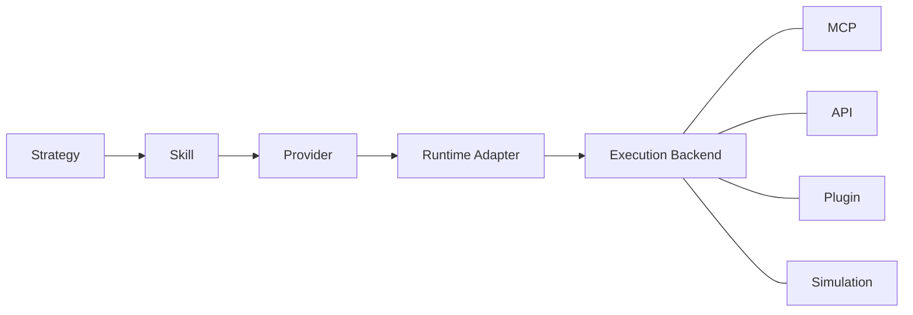

# ASDF‑0010
Provider Resolution

## Purpose

Defines a provider abstraction that decouples ASDF skills from specific runtime implementations. Skills reference logical providers and actions. Runtimes resolve providers to concrete adapters and execution backends.

## Motivation

ASDF‑0009 allows skills to bind directly to MCP providers:

```yaml
binding:
  type: mcp
  provider: UluDorkFiMCP
  method: deposit
```

This couples the skill definition to a specific runtime implementation. If a different runtime uses a REST API, a plugin system, or a simulation backend, the skill definition must change.

Provider resolution introduces an intermediate abstraction:

```
Strategy → Skill → Provider → Runtime Adapter → Execution Backend
```

Skills declare *what* provider and action they need. Runtimes decide *how* to execute them.

## Architecture



A strategy step resolves to a skill. The skill declares a logical provider and action. The runtime resolves the provider to an adapter (such as MCP) and dispatches the action to the execution backend.

## Skill Provider Reference

Skills reference providers using a `provider` block instead of a direct `binding` block.

```yaml
skill: asdf://protocol/dorkfi/deposit

inputs:
  asset:
    type: token
  amount:
    type: number

outputs:
  position_id:
    type: string

provider:
  name: dorkfi
  action: deposit
```

### Fields

| Field | Required | Description |
|-------|----------|-------------|
| `name` | yes | Logical provider name. |
| `action` | yes | Action to invoke on the provider. |

The skill does not specify how the provider is implemented. That responsibility belongs to the runtime.

## Provider Registry

A provider registry declares the available providers and their actions. It may be defined in a project's ASDF configuration or discovered at runtime.

```yaml
providers:

  dorkfi:
    actions:
      deposit:
        capability: protocol
      borrow:
        capability: protocol
      repay:
        capability: protocol

  wallet:
    actions:
      sign:
        capability: wallet
      broadcast:
        capability: broadcast
```

### Fields

| Field | Required | Description |
|-------|----------|-------------|
| `actions` | yes | Map of action names to action metadata. |
| `actions.<name>.capability` | yes | The capability category required by this action (ASDF‑0008). |

The registry is a logical declaration. It does not specify runtime details.

## Runtime Provider Mapping

Runtimes map logical providers to concrete adapters and implementations.

```yaml
runtime:

  providers:

    dorkfi:
      adapter: mcp
      provider: UluDorkFiMCP

      actions:
        deposit: deposit
        borrow: borrow
        repay: repay

    wallet:
      adapter: mcp
      provider: UluWalletMCP

      actions:
        sign: signTransaction
        broadcast: broadcastTransaction
```

### Fields

| Field | Required | Description |
|-------|----------|-------------|
| `adapter` | yes | Adapter type. Currently `mcp`. Future adapters may include `api`, `plugin`, `simulation`. |
| `provider` | yes* | Concrete provider name for the adapter. Required unless `networks` is used. |
| `actions` | yes | Map of logical action names to adapter method names. |
| `networks` | no | Map of network keys to network-specific provider configurations. |

*Required when `networks` is not used.

### Action Mapping

The `actions` map translates logical action names (as declared in the skill) to concrete method names on the adapter.

If a skill declares `action: deposit` and the runtime maps `deposit: deposit`, the adapter invokes the `deposit` method. If the runtime maps `deposit: createDeposit`, the adapter invokes `createDeposit` instead.

This allows the same skill to work across runtimes that use different method naming conventions.

## Multi-Network Resolution

Protocols that operate across multiple networks may require different provider configurations depending on the active network context.

```yaml
runtime:

  providers:

    dorkfi:
      adapter: mcp

      networks:

        voi:
          provider: UluDorkFiMCP
          method_prefix: voi_

        algorand:
          provider: UluDorkFiMCP
          method_prefix: algo_

      actions:
        deposit: deposit
        borrow: borrow
        repay: repay
```

When `networks` is present, the runtime selects the matching network entry based on context. The resolved method name is constructed by combining the `method_prefix` with the action's mapped method name.

For example, on the Voi network, the skill action `deposit` resolves to method `voi_deposit` on `UluDorkFiMCP`.

### Network Resolution Fields

| Field | Required | Description |
|-------|----------|-------------|
| `provider` | yes | Concrete provider name for this network. |
| `method_prefix` | no | Prefix applied to all action method names for this network. |

If no `method_prefix` is specified, method names are used as-is from the `actions` map.

If no matching network is found at runtime, resolution fails with a provider resolution error.

## Resolution Order

When resolving a skill at runtime:

1. Look up the skill by its `asdf://` reference (ASDF‑0002).
2. Load the skill interface definition (ASDF‑0007).
3. Read the skill's `provider` block to determine the logical provider and action.
4. Look up the provider in the runtime provider mapping.
5. If `networks` is present, select the network-specific configuration based on runtime context.
6. Resolve the concrete adapter, provider name, and method name.
7. Verify all required capabilities are approved (ASDF‑0008).
8. Map strategy inputs to adapter method parameters.
9. Invoke the method on the resolved provider via the adapter.
10. Map adapter results back to skill outputs.

## Relationship to ASDF‑0009

ASDF‑0009 defines MCP bindings as part of the skill definition itself. ASDF‑0010 introduces a layer of indirection between skills and MCP.

The two approaches may coexist:

- Skills with a `binding` block (ASDF‑0009) bind directly to an MCP provider. This is suitable for tightly coupled, single-runtime projects.
- Skills with a `provider` block (ASDF‑0010) reference a logical provider. This is suitable for portable skills that target multiple runtimes.

If both `binding` and `provider` are present, the runtime should prefer `provider` and use ASDF‑0010 resolution. The `binding` block may serve as a fallback or as documentation of the default MCP target.

## Error Conditions

| Condition | Behavior |
|-----------|----------|
| Skill references unknown provider | Provider resolution error |
| Provider has no mapping for requested action | Action resolution error |
| Network context required but not available | Network resolution error |
| Network context does not match any configured network | Network resolution error |
| Required capability not approved | Capability denial error |
| Adapter type not supported by runtime | Adapter error |
| Concrete provider unavailable | Runtime error |

## Status

Accepted
