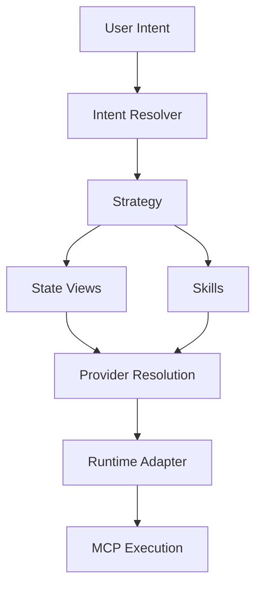

# ASDF‑0012
Intent Specification

## Purpose

Defines a standardized way for users, agents, or LLMs to express high-level goals (intents) that can be resolved into deterministic ASDF strategies.

ASDF **strategies** describe *how* automation executes.  
ASDF **intents** describe *what* a user wants to achieve.

## Motivation

Users think in goals, not workflows:

- maintain my DorkFi health factor above 1.3
- swap USDC to VOI at the best price
- rebalance liquidity across chains
- bridge funds where yield is highest

Without an intent layer, every user goal must be manually translated into a strategy. Intents provide a structured representation of goals that runtimes can resolve into the appropriate strategy automatically.

## Architecture



Intents represent the top layer of the ASDF automation stack. A user expresses a goal. The intent resolver maps that goal to a strategy. The strategy executes using views, skills, providers, and runtime adapters as defined by existing ASDF specifications.

## Intent URI Format

Intents use the `asdf://intent/` URI scheme:

```
asdf://intent/<domain>/<name>
```

Examples:

```
asdf://intent/defi/maintain_health
asdf://intent/defi/best_swap
asdf://intent/bridge/optimize_route
asdf://intent/portfolio/rebalance
```

The `<domain>` groups intents by functional area. The `<name>` identifies the specific goal.

## Intent Definition

An intent declares a goal, its inputs, optional parameters, and a strategy resolution method.

```yaml
intent: asdf://intent/defi/maintain_health

description:
  Maintain a healthy collateralization ratio.

inputs:
  account:
    type: address

parameters:
  min_health_factor:
    type: number
    default: 1.3

strategy:
  resolver: strategy_registry
```

### Fields

| Field | Required | Description |
|-------|----------|-------------|
| `intent` | yes | Intent URI using the `asdf://intent/` scheme. |
| `description` | yes | Human-readable description of the goal. |
| `inputs` | yes | Typed input fields required to fulfill the intent. |
| `parameters` | no | Optional parameters with defaults that tune the behavior. |
| `strategy` | yes | Strategy resolution configuration. |

## Intents vs Strategies

| | Intent | Strategy |
|---|--------|----------|
| Expresses | A goal | A workflow |
| URI scheme | `asdf://intent/` | N/A (file-based) |
| Contains steps | No | Yes |
| References skills | No (indirectly via strategy) | Yes |
| Created by | Users, agents, LLMs | Developers, automation tooling |
| Deterministic | Goal is declarative; resolution may vary | Execution is deterministic |

Intents are resolved into strategies. Strategies are executed deterministically.

## Strategy Resolution

The `strategy` block on an intent defines how the runtime maps the intent to a concrete strategy.

### Template Resolution

The simplest form references a strategy file directly:

```yaml
intent: asdf://intent/defi/best_swap

inputs:
  from:
    type: token
  to:
    type: token
  amount:
    type: number

strategy:
  template: best_route.strategy
```

The runtime loads `best_route.strategy`, binds the intent inputs, and executes the strategy.

### Registry Resolution

For dynamic resolution, the intent may reference a strategy registry:

```yaml
intent: asdf://intent/defi/maintain_health

inputs:
  account:
    type: address

parameters:
  min_health_factor:
    type: number
    default: 1.3

strategy:
  resolver: strategy_registry
```

The runtime queries the strategy registry with the intent URI and context to select the most appropriate strategy. This allows the same intent to resolve to different strategies depending on runtime conditions, available providers, or network context.

### Resolution Methods

| Method | Field | Description |
|--------|-------|-------------|
| Template | `strategy.template` | Static reference to a strategy file. |
| Registry | `strategy.resolver` | Dynamic lookup via a named resolver. |

If both `template` and `resolver` are specified, `template` takes precedence.

## Resolution Flow

```
User Intent
   ↓
Intent Resolver
   ↓
Strategy Template
   ↓
Strategy Execution
```

**Example:**

1. User expresses: "maintain my DorkFi position health"
2. Runtime matches intent: `asdf://intent/defi/maintain_health`
3. Intent resolver loads strategy: `maintain_health.strategy`
4. Strategy executes using state views, skills, and providers

The resolved strategy:

```
strategy maintain_health

input
  account

view position
  use asdf://view/dorkfi/position
  account = account

if position.health_factor < 1.2
  step repay
    use asdf://protocol/dorkfi/repay
    amount = 100
```

## Intent Parameters

Parameters allow intents to be tuned without modifying the underlying strategy. Parameters are passed to the resolved strategy as additional context.

```yaml
parameters:
  min_health_factor:
    type: number
    default: 1.3
  max_slippage:
    type: number
    default: 0.01
```

Parameters differ from inputs:

| | Input | Parameter |
|---|-------|-----------|
| Required | Yes | No (has default) |
| Provided by | User or agent | Configuration or override |
| Purpose | Core data for execution | Tuning behavior |

## LLM Integration

Intents may be generated by LLMs from natural language. The LLM's role is to:

1. Parse the user's natural language goal.
2. Identify the matching intent URI.
3. Extract input values from the user's message.
4. Submit the structured intent to the runtime.

The LLM does not execute the strategy. It translates natural language into a structured intent. The runtime handles resolution and execution deterministically.

```
Natural Language → LLM → Structured Intent → Runtime → Strategy → Execution
```

This preserves the boundary between non-deterministic interpretation (LLM) and deterministic execution (ASDF runtime).

## Determinism

Intents introduce a resolution step that may not be fully deterministic — the same intent could resolve to different strategies depending on context, available providers, or runtime conditions.

To maintain predictability:

1. Template-based resolution is fully deterministic. The same intent always resolves to the same strategy.
2. Registry-based resolution may vary. The resolver must document its selection criteria.
3. Once a strategy is selected, execution follows the deterministic guarantees of the strategy DSL (ASDF‑0006).
4. Intent resolution decisions should be logged for auditability.

## Capabilities

Intents do not declare capabilities directly. Capabilities are declared on the skills and views invoked by the resolved strategy (ASDF‑0008). The runtime verifies capabilities at execution time, not at intent resolution time.

## Error Conditions

| Condition | Behavior |
|-----------|----------|
| Intent URI not recognized | Intent resolution error |
| No strategy found for intent | Resolution error |
| Required input missing | Validation error |
| Resolved strategy fails capability check | Capability denial error |
| Strategy execution error | Delegated to strategy error handling |

## Status

Draft
