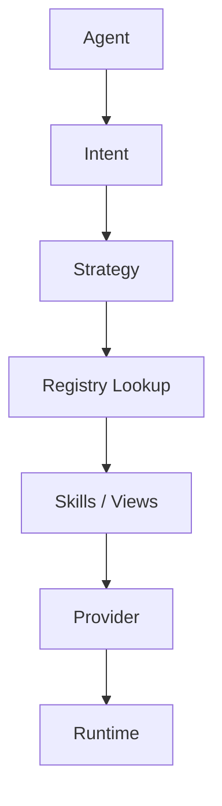

# ASDF‑0013
Registry Specification

## Purpose

Defines a global discovery mechanism that allows ASDF runtimes and agents to discover skills, state views, strategies, intents, and providers.

The registry acts as a structured catalog for agent capabilities and automation workflows, similar to how npm serves packages or Docker Hub serves container images — but for ASDF resources.

## Motivation

ASDF specifications describe how capabilities are defined and executed, but they do not define how capabilities are globally discovered. A project can reference `asdf://skill/dorkfi/deposit`, but there is no standard way to resolve that reference to a concrete definition hosted elsewhere.

The registry specification closes this gap by providing:

- a standard schema for registry entries
- URI-based resource discovery
- support for centralized, decentralized, local, and enterprise-scoped registries
- a query interface for browsing available capabilities

## Architecture



An agent expresses an intent. The runtime resolves it to a strategy. The strategy references skills and views. The registry resolves those references to concrete definitions. Providers and runtime adapters handle execution.

## Registry URI Formats

Registry resources use the `asdf://` URI scheme with a type prefix:

```
asdf://skill/<domain>/<name>
asdf://view/<domain>/<name>
asdf://strategy/<domain>/<name>
asdf://intent/<domain>/<name>
asdf://provider/<domain>/<name>
```

Examples:

```
asdf://skill/dorkfi/deposit
asdf://view/humbleswap/quote
asdf://strategy/defi/maintain_health
asdf://intent/defi/best_swap
asdf://provider/dorkfi/main
```

The `<domain>` groups resources by protocol, organization, or functional area. The `<name>` identifies the specific resource.

## Registry Categories

Registries organize resources into five categories:

| Category | Description |
|----------|-------------|
| `skills` | Actions an agent can perform (ASDF‑0007) |
| `views` | Read-only state queries (ASDF‑0011) |
| `strategies` | Deterministic workflows (ASDF‑0006) |
| `intents` | High-level user goals (ASDF‑0012) |
| `providers` | Logical protocol/service references (ASDF‑0010) |

## Registry Entry Schema

Each registry entry describes a single ASDF resource.

```yaml
id: asdf://skill/dorkfi/deposit
type: skill
version: 1
author: shelly
description: Deposit assets into a DorkFi lending position.
location: https://registry.example.com/skills/dorkfi/deposit.yaml
checksum: sha256:a1b2c3d4e5f6...
```

### Fields

| Field | Required | Description |
|-------|----------|-------------|
| `id` | yes | Full `asdf://` URI for the resource. |
| `type` | yes | Resource type: `skill`, `view`, `strategy`, `intent`, or `provider`. |
| `version` | yes | Version number. |
| `author` | no | Author or maintainer. |
| `description` | no | Human-readable summary. |
| `location` | yes | URL where the resource definition can be fetched. |
| `checksum` | no | Integrity hash of the resource definition. Format: `algorithm:hex`. |

## Registry Types

Registries may operate at different scopes:

| Type | Description |
|------|-------------|
| Centralized | A single hosted registry serving a public ecosystem. |
| Decentralized | Federated registries that sync or delegate across nodes. |
| Local | A project-local registry defined in the repository (e.g. a YAML file). |
| Enterprise | A private registry scoped to an organization. |

Runtimes may query multiple registries. Resolution order is implementation-defined but should be configurable.

## Local Registry

A project may define a local registry as a YAML file in the repository:

```yaml
registry:
  - id: asdf://skill/dorkfi/deposit
    type: skill
    version: 1
    location: ./skills/dorkfi/deposit.yaml

  - id: asdf://view/dorkfi/position
    type: view
    version: 1
    location: ./views/dorkfi/position.yaml

  - id: asdf://strategy/defi/maintain_health
    type: strategy
    version: 1
    location: ./strategies/maintain_health.strategy
```

Local entries take precedence over remote entries for the same `id`.

## API Interface

Remote registries should expose a query interface. The following REST-style endpoints are recommended:

```
GET /skills
GET /skills/{domain}/{name}
GET /views
GET /views/{domain}/{name}
GET /strategies
GET /strategies/{domain}/{name}
GET /intents
GET /intents/{domain}/{name}
GET /providers
GET /providers/{domain}/{name}
```

### List Response

```json
{
  "entries": [
    {
      "id": "asdf://skill/dorkfi/deposit",
      "type": "skill",
      "version": 1,
      "description": "Deposit assets into a DorkFi lending position."
    }
  ]
}
```

### Detail Response

```json
{
  "id": "asdf://skill/dorkfi/deposit",
  "type": "skill",
  "version": 1,
  "author": "shelly",
  "description": "Deposit assets into a DorkFi lending position.",
  "location": "https://registry.example.com/skills/dorkfi/deposit.yaml",
  "checksum": "sha256:a1b2c3d4e5f6..."
}
```

## Resolution Workflow

**Example:** A user expresses the intent "swap USDC to VOI".

1. The runtime matches intent `asdf://intent/defi/best_swap`.
2. The registry returns the intent definition, which references strategy `best_route.strategy`.
3. The strategy references:
   - `asdf://view/humbleswap/quote`
   - `asdf://skill/humbleswap/swap`
4. The registry resolves each reference to a concrete definition.
5. Provider resolution maps skills and views to runtime adapters (ASDF‑0010).
6. Execution proceeds via the runtime adapter.

```
User: "swap USDC to VOI"
   ↓
Intent: asdf://intent/defi/best_swap
   ↓
Registry → best_route.strategy
   ↓
Registry → asdf://view/humbleswap/quote
Registry → asdf://skill/humbleswap/swap
   ↓
Provider Resolution
   ↓
Execution
```

## Versioning

Registry entries include a `version` field. When multiple versions of a resource exist, the registry should:

1. Return the latest version by default.
2. Allow version-specific queries (e.g. `GET /skills/dorkfi/deposit?version=2`).
3. Maintain backward compatibility for previously published versions.

Version numbers are integers. Breaking changes require a new version.

## Integrity

The optional `checksum` field allows runtimes to verify that fetched definitions match the expected content. This is important for:

- security (preventing tampered definitions)
- reproducibility (ensuring consistent behavior across executions)
- auditability (logging which exact definition was used)

If a checksum is present and verification fails, the runtime must reject the resource.

## Error Conditions

| Condition | Behavior |
|-----------|----------|
| Resource URI not found in any registry | Registry resolution error |
| Location URL unreachable | Fetch error |
| Checksum verification fails | Integrity error |
| Resource type does not match expected type | Type mismatch error |
| Version not found | Version resolution error |

## Status

Draft
