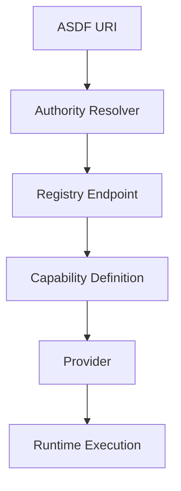

# ASDF‑0014
Capability Authority Resolution

## Purpose

Defines how ASDF URIs resolve capabilities using authority domains, enabling decentralized capability ownership and discovery across protocols.

## Motivation

Current ASDF URIs use a flat namespace with a type prefix:

```
asdf://skill/dorkfi/deposit
asdf://view/humbleswap/quote
```

This structure relies on centralized registries to resolve references. It does not express ownership or allow protocols to control their own capability namespaces.

Authority-based resolution introduces DNS-like semantics into ASDF URIs. Each authority domain controls its own capabilities, registries, and resolution endpoints. This enables:

- decentralized capability ownership
- protocol-controlled namespaces
- federation of registries
- composable agent ecosystems across independent organizations
- DNS-like capability discovery

## URI Structure

Authority-based ASDF URIs follow this format:

```
asdf://<authority>/<resource>
```

| Component | Description |
|-----------|-------------|
| `authority` | Capability namespace owner (domain-style identifier). |
| `resource` | Skill, view, strategy, or intent name. |

### Examples

```
asdf://dorkfi.protocol/deposit
asdf://humbleswap.dex/swap
asdf://defi.intent/best_swap
asdf://bridge.protocol/route
asdf://voi.chain/send
asdf://algorand.chain/transfer
```

### Authority Domains

Authority domains use dot-separated identifiers that indicate the organization and category:

```
dorkfi.protocol
humbleswap.dex
uniswap.dex
curve.dex
defi.intent
bridge.protocol
voi.chain
algorand.chain
```

The rightmost segment acts as a category hint (e.g. `protocol`, `dex`, `chain`, `intent`). This is a convention, not an enforced type constraint.

## Architecture



A runtime parses the ASDF URI, resolves the authority to a registry endpoint, fetches the capability definition, resolves the provider, and executes.

## Authority Resolution

Given a URI such as `asdf://dorkfi.protocol/deposit`, the runtime:

1. Extracts the authority: `dorkfi.protocol`
2. Resolves the authority to a registry endpoint.
3. Queries the registry for the resource `deposit`.
4. Loads the capability definition.
5. Proceeds with provider resolution (ASDF‑0010) and execution.

### Resolution Methods

Runtimes may resolve authorities using:

| Method | Description |
|--------|-------------|
| Local configuration | A mapping of authorities to registry URLs defined in the runtime configuration. |
| Well-known URL | Fetching `https://<authority>/.well-known/asdf-registry` for auto-discovery. |
| DNS TXT record | A TXT record at the authority domain pointing to the registry URL. |
| Registry federation | Querying a parent registry that delegates to authority-specific registries. |

Runtimes must support local configuration. Other methods are optional.

## Authority Registry Record

Each authority publishes metadata describing its registry:

```yaml
authority: dorkfi.protocol

registry:
  url: https://registry.dorkfi.xyz/asdf

maintainer:
  organization: DorkFi Labs
```

### Fields

| Field | Required | Description |
|-------|----------|-------------|
| `authority` | yes | The authority domain identifier. |
| `registry.url` | yes | Base URL of the authority's registry endpoint. |
| `maintainer.organization` | no | Organization responsible for the authority. |

## Capability Lookup

Once the registry endpoint is resolved, the runtime fetches capability definitions using REST-style queries:

```
GET {registry}/skills/{resource}
GET {registry}/views/{resource}
GET {registry}/strategies/{resource}
GET {registry}/intents/{resource}
```

**Example:**

```
GET https://registry.dorkfi.xyz/asdf/skills/deposit
```

The response returns the capability definition:

```yaml
skill: asdf://dorkfi.protocol/deposit

inputs:
  asset:
    type: token
  amount:
    type: number

outputs:
  position_id:
    type: string

provider:
  name: dorkfi
  action: deposit
```

The runtime determines the resource type (skill, view, strategy, intent) based on the definition content or an explicit `type` field in the response metadata.

## Capability Definition

Authority-resolved capabilities use the same definition formats as existing ASDF specifications:

- Skills follow ASDF‑0007.
- Views follow ASDF‑0011.
- Strategies follow ASDF‑0006.
- Intents follow ASDF‑0012.
- Providers follow ASDF‑0010.

The only difference is the URI format. Instead of `asdf://skill/dorkfi/deposit`, the authority form is `asdf://dorkfi.protocol/deposit`.

## Relationship to ASDF‑0013

ASDF‑0013 defines a centralized registry model with type-prefixed URIs. ASDF‑0014 extends this with authority-based namespaces.

The two models may coexist:

| Model | URI format | Registry | Ownership |
|-------|------------|----------|-----------|
| ASDF‑0013 | `asdf://skill/dorkfi/deposit` | Centralized or local | Registry operator |
| ASDF‑0014 | `asdf://dorkfi.protocol/deposit` | Authority-controlled | Protocol/organization |

Runtimes should support both formats. When an authority-based URI is encountered, the runtime resolves the authority first. When a type-prefixed URI is encountered, the runtime queries registries as defined in ASDF‑0013.

## Resolution Order

When resolving an authority-based URI:

1. Parse the URI to extract authority and resource.
2. Resolve the authority to a registry endpoint.
3. Query the registry for the resource definition.
4. Validate the response against the expected ASDF schema.
5. Load the capability definition (skill, view, strategy, or intent).
6. Proceed with provider resolution (ASDF‑0010).
7. Verify capabilities (ASDF‑0008).
8. Execute via the runtime adapter.

## Caching

Authority resolution results and capability definitions may be cached by the runtime. Recommended policies:

| Target | Cache behavior |
|--------|----------------|
| Authority → registry URL | Cache with long TTL. Authority mappings change infrequently. |
| Capability definitions | Cache per version. Versioned definitions are immutable. |
| Registry list queries | Cache with short TTL or refresh on demand. |

## Error Conditions

| Condition | Behavior |
|-----------|----------|
| Authority not resolvable | Authority resolution error |
| Registry endpoint unreachable | Fetch error |
| Resource not found at registry | Resource resolution error |
| Definition does not match expected schema | Validation error |
| Checksum verification fails (if provided) | Integrity error |

## Status

Draft
