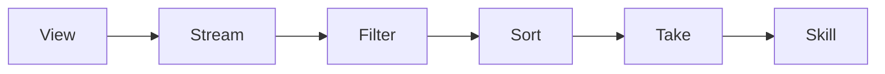

# ASDF‑0015
Stream Composition and Pipe Semantics

## Purpose

Defines typed streams and pipe-based composition for ASDF strategies, enabling deterministic dataflow pipelines similar to Unix pipes.

## Motivation

Many automation tasks follow a data pipeline pattern:

1. Retrieve data
2. Filter results
3. Rank or transform
4. Select a subset
5. Execute an action

ASDF strategies currently define ordered steps and conditional logic, but they lack a composable way to express this pattern. Pipe semantics solve this by allowing typed outputs to flow from one capability to the next in a deterministic chain.

Unix expresses this naturally:

```
ps | grep node | sort | head
```

ASDF strategies should support a similar pattern:

```
view asdf://view/dex/pools
| filter active = true
| sort apr desc
| take 1
| use asdf://protocol/dex/deposit
```

## Architecture



A view produces a typed stream. Transform operators process the stream. The final result is passed to a skill for execution or bound to a variable for use in subsequent strategy logic.

## Typed Streams

Capabilities may return either a single object or a stream (ordered list) of typed objects.

A stream is declared using the `stream<T>` type:

```yaml
view: asdf://view/dex/pools

outputs:
  pools:
    type: stream<pool>
```

```yaml
view: asdf://view/dorkfi/positions

outputs:
  positions:
    type: stream<position>
```

Stream types ensure that transforms and downstream capabilities receive data in the expected shape. The inner type (e.g. `pool`, `position`, `route`) is defined by the view or skill that produces the stream.

### Type Definitions

Stream element types are structural. A `pool` type might include:

```yaml
pool:
  name: string
  apr: number
  tvl: number
  active: boolean
```

Transforms must preserve or narrow the element type. A `filter` does not change the type. A `map` may produce a new type.

## Pipe Syntax

Pipes chain capabilities and transforms using the `|` operator. Each segment receives the output of the previous segment as input.

```
view asdf://view/dex/pools
| filter active = true
| sort apr desc
| take 1
| use asdf://protocol/dex/deposit
```

### Syntax Rules

1. A pipe chain begins with a `view` or any capability that produces a stream.
2. Each `|` passes the current stream to the next operator.
3. Transform operators process the stream and produce a new stream (or a single value for terminal operators).
4. A pipe chain may end with a `use` clause to pass the result to a skill, or it may bind to a variable for later use.

### Binding Pipe Results

Pipe results may be bound to a name for use in subsequent strategy logic:

```
strategy best_deposit

input
  min_apr

pipe best_pool
  view asdf://view/dex/pools
  | filter active = true
  | filter apr >= min_apr
  | sort apr desc
  | take 1

step deposit
  use asdf://protocol/dex/deposit
  pool = best_pool.name
  amount = 1000
```

## Transform Operators

The specification defines a minimal set of deterministic transform operators:

| Operator | Purpose | Input | Output |
|----------|---------|-------|--------|
| `filter` | Remove items that do not match a condition | `stream<T>` | `stream<T>` |
| `map` | Transform each item | `stream<T>` | `stream<U>` |
| `sort` | Order items by a field | `stream<T>` | `stream<T>` |
| `take` | Limit to the first N items | `stream<T>` | `stream<T>` |
| `group` | Group items by a key field | `stream<T>` | `stream<group<K, T>>` |
| `reduce` | Aggregate items into a single value | `stream<T>` | `U` |

### filter

Removes items that do not satisfy a condition.

```
| filter active = true
| filter apr > 5.0
| filter health_factor < 1.2
```

Supported comparison operators: `=`, `!=`, `<`, `>`, `<=`, `>=`.

### map

Transforms each item in the stream by selecting or computing fields.

```
| map name, apr
| map spread = ask - bid
```

### sort

Orders items by a field. Direction is `asc` (ascending) or `desc` (descending).

```
| sort apr desc
| sort health_factor asc
```

If no direction is specified, `asc` is the default.

### take

Limits the stream to the first N items.

```
| take 1
| take 10
```

After a `take 1`, the result may be treated as a single object rather than a stream.

### group

Groups items by a key field. Produces a stream of groups.

```
| group network
```

Each group contains a key and a list of items sharing that key.

### reduce

Aggregates a stream into a single value.

```
| reduce total_tvl = sum(tvl)
| reduce count = count()
| reduce avg_apr = avg(apr)
```

Built-in aggregation functions: `sum`, `count`, `avg`, `min`, `max`.

## Strategy Examples

### Best Pool Deposit

Select the highest-APR active pool and deposit into it:

```
strategy best_pool_deposit

input
  amount

pipe target
  view asdf://view/dex/pools
  | filter active = true
  | sort apr desc
  | take 1

step deposit
  use asdf://protocol/dex/deposit
  pool = target.name
  amount = amount
```

### Liquidation Scan

Find the 20 most at-risk positions:

```
strategy liquidation_scan

pipe at_risk
  view asdf://view/dorkfi/positions
  | filter health_factor < 1.05
  | sort health_factor asc
  | take 20
```

### Cross-Network Route Selection

Find the best bridge route by fee:

```
strategy cheapest_bridge

input
  asset
  amount

pipe best_route
  view asdf://view/bridge/routes
  | filter asset = asset
  | filter amount >= amount
  | sort fee asc
  | take 1

step bridge
  use asdf://protocol/bridge/transfer
  route = best_route.id
  amount = amount
```

## Determinism

Pipe semantics must remain deterministic:

1. All transform operators produce the same output given the same input.
2. `sort` must use a stable sort algorithm. Items with equal sort keys retain their original order.
3. `filter` conditions use value comparison only. No side effects are permitted.
4. `reduce` aggregation functions are pure. Custom aggregation functions are not supported in this version.
5. Stream processing is eager, not lazy. The entire stream is materialized at each stage.

## Integration with Strategy DSL

Pipe chains extend the strategy DSL (ASDF‑0006) with a new `pipe` block. Existing `view`, `step`, and `if`/`else` constructs remain unchanged.

```
strategy example

input
  account

pipe data
  view asdf://view/protocol/positions
  | filter owner = account
  | sort value desc

if data.length > 0
  step act
    use asdf://protocol/action
    position = data[0].id
```

The `pipe` block produces a named result. The result is available to subsequent `step`, `if`, and `pipe` blocks.

## Integration with Provider Resolution

Views invoked at the start of a pipe chain resolve through the standard provider resolution mechanism (ASDF‑0010). Skills invoked at the end of a pipe chain also resolve through providers.

Transform operators (`filter`, `sort`, `map`, `take`, `group`, `reduce`) execute locally within the runtime. They do not invoke providers or require capabilities.

## Error Conditions

| Condition | Behavior |
|-----------|----------|
| Pipe source does not produce a stream | Type error |
| Filter references unknown field | Field resolution error |
| Sort references unknown field | Field resolution error |
| Map produces invalid type | Type error |
| Take with N < 1 | Validation error |
| Reduce uses unknown aggregation function | Validation error |
| Pipe result used as single object but stream has 0 items | Empty stream error |

## Status

Draft
