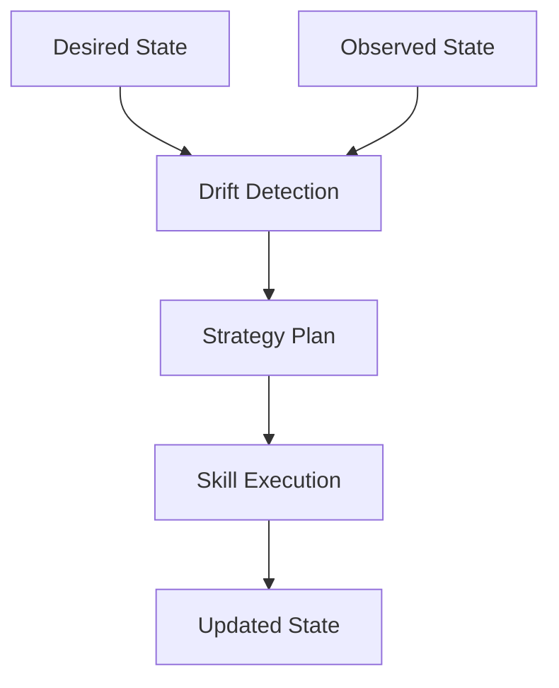

# ASDF‑0016
Managed Resource Model

## Purpose

Defines a declarative resource model that enables ASDF runtimes to manage long-lived system states through desired-state reconciliation, similar to Terraform or Kubernetes controllers.

## Motivation

ASDF strategies define workflows that execute once. However, many automation tasks require continuous management of system state:

- maintain a lending position's health factor above a threshold
- keep liquidity balanced across pools
- ensure swap targets are filled at the best available rate
- enforce governance policies over time

These tasks are not one-shot workflows. They require the runtime to observe state, compare it against a desired target, plan corrective actions, and apply them — repeatedly.

The managed resource model introduces this capability by combining existing ASDF primitives (views, skills, strategies, providers) into a reconciliation loop.

## Architecture



The runtime declares a desired state. Views observe actual state. Drift detection compares the two. A strategy plan determines corrective actions. Skills execute those actions. The loop repeats until drift is eliminated.

## Resource URI Format

Managed resources use the `asdf://resource/` URI scheme:

```
asdf://resource/<domain>/<type>
```

Examples:

```
asdf://resource/dorkfi/position
asdf://resource/dorkfi/health_policy
asdf://resource/defi/liquidity_policy
asdf://resource/defi/swap_target
asdf://resource/bridge/route_target
```

The `<domain>` groups resources by protocol or functional area. The `<type>` identifies the kind of managed resource.

## Resource Declaration

A managed resource declares a desired target state that the runtime reconciles against observed state.

```yaml
resource: asdf://resource/dorkfi/health_policy

target:
  account: ABC123
  min_health_factor: 1.3
  max_idle_cash: 50
```

### Fields

| Field | Required | Description |
|-------|----------|-------------|
| `resource` | yes | Resource URI using the `asdf://resource/` scheme. |
| `target` | yes | Desired state fields and values. |

The runtime is responsible for interpreting the target, observing current state, detecting drift, and executing reconciliation.

## Resource Definition

A resource definition describes the structure of a managed resource, including which views observe it and which skills modify it.

```yaml
resource: asdf://resource/dorkfi/health_policy

target_schema:
  account:
    type: address
  min_health_factor:
    type: number
  max_idle_cash:
    type: number

observe:
  view: asdf://view/dorkfi/position
  input_map:
    account: target.account

reconcile:
  strategy: maintain_health.strategy
  input_map:
    account: target.account
    min_health_factor: target.min_health_factor
```

### Fields

| Field | Required | Description |
|-------|----------|-------------|
| `resource` | yes | Resource URI. |
| `target_schema` | yes | Typed schema for the target state fields. |
| `observe` | yes | View used to fetch current state. |
| `observe.view` | yes | View URI (ASDF‑0011). |
| `observe.input_map` | yes | Maps target fields to view inputs. |
| `reconcile` | yes | Strategy used for reconciliation. |
| `reconcile.strategy` | yes | Strategy file or URI. |
| `reconcile.input_map` | yes | Maps target fields to strategy inputs. |

## Resource Lifecycle

A managed resource moves through four phases in each reconciliation cycle:

### Observe

The runtime invokes the resource's view to fetch current state.

```
observe → asdf://view/dorkfi/position
         account = ABC123
         → { health_factor: 1.15, collateral: 500, debt: 430 }
```

### Plan

The runtime compares observed state to the desired target and determines whether action is needed.

```
target.min_health_factor = 1.3
observed.health_factor = 1.15
drift detected: health_factor below threshold
```

### Apply

The runtime loads the reconciliation strategy and executes it.

```
apply → maintain_health.strategy
       account = ABC123
       min_health_factor = 1.3
       → executes repay or deposit skills
```

### Reconcile

The runtime repeats the observe–plan–apply cycle until drift is eliminated or a maximum iteration count is reached.

```
observe → plan → apply → observe → plan → (no drift) → done
```

## Drift Detection

Drift is detected when observed state does not satisfy the constraints defined by the target.

Drift rules are derived from the target schema:

| Target Field | Drift Condition |
|-------------|-----------------|
| `min_health_factor: 1.3` | Drift if `observed.health_factor < 1.3` |
| `max_idle_cash: 50` | Drift if `observed.idle_cash > 50` |

For exact-match fields, drift occurs when the observed value differs from the target value. For threshold fields (prefixed with `min_` or `max_`), drift occurs when the observed value crosses the threshold.

## Integration with Existing Specifications

Managed resources compose existing ASDF primitives:

| Component | Role in Resource Model |
|-----------|----------------------|
| State Views (ASDF‑0011) | Observe current state |
| Skills (ASDF‑0007) | Execute state-changing actions |
| Strategies (ASDF‑0006) | Compute reconciliation plans |
| Providers (ASDF‑0010) | Route execution to backends |
| Capabilities (ASDF‑0008) | Enforce permissions during execution |
| Intents (ASDF‑0012) | May trigger resource creation or updates |

Resources do not replace strategies. They use strategies as their reconciliation mechanism.

## Examples

### DorkFi Health Maintenance

Resource declaration:

```yaml
resource: asdf://resource/dorkfi/health_policy

target:
  account: ABC123
  min_health_factor: 1.3
```

Runtime behavior:

1. Call `asdf://view/dorkfi/position` with `account = ABC123`.
2. Compare `health_factor` to `min_health_factor`.
3. If below threshold, execute reconciliation strategy.
4. Strategy invokes `asdf://protocol/dorkfi/repay` or `asdf://protocol/dorkfi/deposit`.
5. Re-observe and confirm drift is resolved.

### Swap Target

Resource declaration:

```yaml
resource: asdf://resource/defi/swap_target

target:
  from: USDC
  to: VOI
  amount: 100
  route_policy: best_available
```

Runtime behavior:

1. Fetch available routes using `asdf://view/dex/routes`.
2. Rank routes according to `route_policy`.
3. Execute swap using `asdf://protocol/dex/swap` on the best route.
4. Observe completion and confirm the target amount was swapped.

### Liquidity Policy

Resource declaration:

```yaml
resource: asdf://resource/defi/liquidity_policy

target:
  pool: VOI-USDC
  min_allocation: 1000
  max_allocation: 5000
```

Runtime behavior:

1. Observe current allocation via `asdf://view/dex/pool_position`.
2. If below `min_allocation`, deposit more.
3. If above `max_allocation`, withdraw excess.
4. Re-observe and confirm allocation is within range.

## Reconciliation Constraints

To maintain determinism and safety:

1. Each reconciliation cycle must have a maximum iteration count. The default is 3. Runtimes may allow configuration.
2. If drift is not resolved within the maximum iterations, the runtime must report a reconciliation failure rather than loop indefinitely.
3. Each apply phase executes a complete strategy. Partial strategy execution is not permitted.
4. All capability checks (ASDF‑0008) are enforced during each apply phase.
5. Reconciliation state (observed, planned, applied) should be logged for auditability.

## Resource States

A managed resource may be in one of the following states:

| State | Description |
|-------|-------------|
| `converged` | Observed state matches desired state. No action needed. |
| `drifted` | Observed state does not match desired state. Reconciliation required. |
| `reconciling` | Reconciliation is in progress. |
| `failed` | Reconciliation could not resolve drift within the iteration limit. |
| `unknown` | Observed state could not be determined (view error). |

## Error Conditions

| Condition | Behavior |
|-----------|----------|
| Resource URI not recognized | Resource resolution error |
| Observe view fails | Observation error; resource enters `unknown` state |
| Drift detected but no reconciliation strategy defined | Configuration error |
| Reconciliation strategy fails | Apply error; resource enters `failed` state |
| Maximum reconciliation iterations exceeded | Reconciliation failure |
| Required capability not approved | Capability denial error |

## Status

Draft
