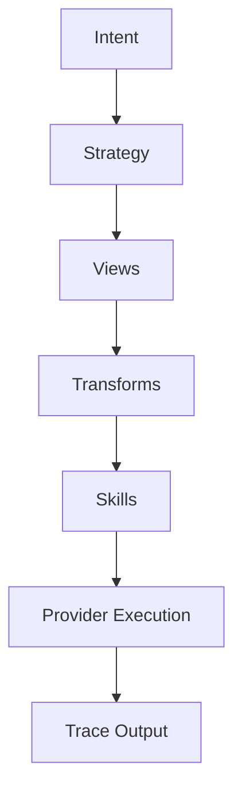

# ASDF‑0017
Execution Trace Model

## Purpose

Defines a standardized trace format for ASDF runtime executions, enabling observability, deterministic replay, auditing, and strategy mining.

## Motivation

ASDF runtimes resolve intents into strategies, query state through views, and execute actions through skills. Without a structured record of these operations, executions cannot be analyzed, replayed, or audited.

Execution traces solve this by capturing the full lifecycle of an ASDF operation in a portable, implementation-agnostic format.

Traces enable:

- **Runtime observability** — inspect what happened during execution
- **Deterministic replay** — reconstruct and re-execute from a trace
- **Audit records** — verifiable logs for compliance and governance
- **Strategy mining** — detect patterns in traces and promote them to reusable strategies
- **Debugging** — isolate failures to specific steps

## Architecture



Each phase of execution emits trace events. The trace output is a structured document that records the full execution path from intent to result.

## Trace Structure

A trace document captures a single ASDF execution.

```yaml
trace_id: trace_abc123
timestamp: 2026-03-09T12:00:00Z

intent:
  id: asdf://intent/defi/best_swap

strategy:
  id: best_swap.strategy

steps:

  - type: view
    id: asdf://view/defi/routes
    inputs:
      from: USDC
      to: VOI
      amount: 100
    outputs:
      routes: [{ provider: humbleswap, expected_output: 102.3 }, { provider: pact, expected_output: 101.8 }]
    duration_ms: 120

  - type: transform
    operator: sort
    field: expected_output
    order: desc

  - type: transform
    operator: take
    count: 1

  - type: skill
    id: asdf://skill/defi/swap
    provider: humbleswap.dex
    inputs:
      from: USDC
      to: VOI
      amount: 100
      route: humbleswap
    outputs:
      received: 102.3
      tx_id: TX_789
    duration_ms: 280

result:
  success: true
  output_amount: 102.3
  gas_cost: 0.02

metadata:
  runtime: uluos
  duration_ms: 430
  gas_cost: 0.02
```

### Top-Level Fields

| Field | Required | Description |
|-------|----------|-------------|
| `trace_id` | yes | Unique identifier for this trace. |
| `timestamp` | yes | ISO 8601 timestamp of execution start. |
| `intent` | no | Intent that initiated the execution, if applicable. |
| `strategy` | yes | Strategy that was executed. |
| `steps` | yes | Ordered list of trace events. |
| `result` | yes | Final execution outcome. |
| `metadata` | no | Runtime and performance metadata. |

## Trace Event Types

Each entry in `steps` represents a trace event. The `type` field identifies the event kind.

| Event Type | Description |
|------------|-------------|
| `intent` | Intent resolution. Records the matched intent URI. |
| `strategy` | Strategy selection. Records the strategy loaded. |
| `view` | State view query. Records inputs, outputs, and duration. |
| `transform` | Stream pipeline operator. Records operator, field, and parameters. |
| `skill` | Skill invocation. Records inputs, outputs, provider, and duration. |
| `provider` | Provider resolution. Records logical-to-concrete mapping. |
| `result` | Final outcome. Records success/failure and output values. |

### View Event

```yaml
- type: view
  id: asdf://view/dorkfi/position
  inputs:
    account: ABC123
  outputs:
    health_factor: 1.15
    collateral: 500
    debt: 430
  duration_ms: 95
```

### Transform Event

```yaml
- type: transform
  operator: filter
  condition: "active = true"
```

### Skill Event

```yaml
- type: skill
  id: asdf://skill/dorkfi/repay
  provider: dorkfi.protocol
  inputs:
    amount: 50
  outputs:
    new_health_factor: 1.35
    tx_id: TX_456
  duration_ms: 310
```

### Provider Event

```yaml
- type: provider
  logical: dorkfi
  resolved:
    adapter: mcp
    provider: UluDorkFiMCP
    method: repay
```

## Trace Event Fields

| Field | Applies To | Required | Description |
|-------|-----------|----------|-------------|
| `type` | all | yes | Event type identifier. |
| `id` | view, skill, intent | yes | ASDF URI of the invoked capability. |
| `inputs` | view, skill | no | Input values passed to the capability. |
| `outputs` | view, skill | no | Output values returned. |
| `provider` | skill, provider | no | Provider used for execution. |
| `duration_ms` | view, skill | no | Execution time in milliseconds. |
| `operator` | transform | yes | Transform operator name. |
| `condition` | transform | no | Filter condition or sort specification. |
| `error` | any | no | Error details if the step failed. |

## Metadata

Trace metadata captures runtime context and aggregate metrics.

```yaml
metadata:
  runtime: uluos
  runtime_version: 0.3.0
  strategy_version: 1
  duration_ms: 430
  gas_cost: 0.02
  network: voi
  provider_versions:
    UluDorkFiMCP: 1.2.0
    UluWalletMCP: 1.0.1
```

| Field | Required | Description |
|-------|----------|-------------|
| `runtime` | no | Runtime identifier. |
| `runtime_version` | no | Runtime version. |
| `strategy_version` | no | Version of the executed strategy. |
| `duration_ms` | no | Total execution time. |
| `gas_cost` | no | Total gas or transaction cost. |
| `network` | no | Network context. |
| `provider_versions` | no | Map of provider names to versions used. |

## Result

The `result` block records the final outcome of the execution.

```yaml
result:
  success: true
  output_amount: 102.3
  gas_cost: 0.02
```

For failed executions:

```yaml
result:
  success: false
  error:
    type: capability_denial
    message: "wallet capability not approved"
    step_index: 3
```

| Field | Required | Description |
|-------|----------|-------------|
| `success` | yes | Whether the execution completed successfully. |
| `error` | no | Error details if execution failed. |
| `error.type` | no | Error category. |
| `error.message` | no | Human-readable error description. |
| `error.step_index` | no | Index of the step that failed. |

Additional output fields are execution-specific and unstructured.

## Deterministic Replay

Traces must contain enough information to allow a runtime to reconstruct and re-execute the operation.

Requirements for replay support:

1. All view inputs and outputs must be recorded.
2. All skill inputs must be recorded.
3. Transform operators and their parameters must be recorded.
4. Provider resolution decisions must be recorded.
5. The strategy version and provider versions must be recorded in metadata.

A runtime replaying a trace may substitute recorded view outputs instead of querying live state, enabling offline simulation and testing.

## Strategy Mining

Execution traces serve as raw material for discovering reusable strategies.

### Mining Flow

```
User requests
   ↓
Execution traces recorded
   ↓
Repeated patterns detected
   ↓
Promote to reusable strategy
   ↓
Publish to registry
```

### How Mining Works

1. **Collection** — Runtimes emit traces for every execution.
2. **Aggregation** — Traces are grouped by intent, strategy, or capability pattern.
3. **Pattern detection** — Repeated sequences of views, transforms, and skills are identified.
4. **Validation** — Candidate strategies are tested against historical traces for correctness.
5. **Promotion** — Validated strategies are published to the registry (ASDF‑0013).

This creates a feedback loop where agent behavior improves over time:

```
LLM → Discover → Execute → Trace → Mine → Registry → Repeat
```

### Mining Considerations

- Traces should be anonymized before mining (remove account-specific data).
- Only successful traces should be candidates for mining.
- Mined strategies must pass the same validation as manually authored strategies.
- Mining does not modify existing strategies.

## Storage

This specification does not mandate a specific storage format or backend. Traces may be stored as:

- YAML or JSON files
- Database records
- Event stream entries
- Append-only logs

Implementations should ensure traces are immutable once written.

## Error Conditions

| Condition | Behavior |
|-----------|----------|
| Trace ID collision | Storage error |
| Step references unknown capability | Trace validation warning |
| Replay encounters missing view output | Replay error |
| Trace document malformed | Parse error |

## Status

Draft
