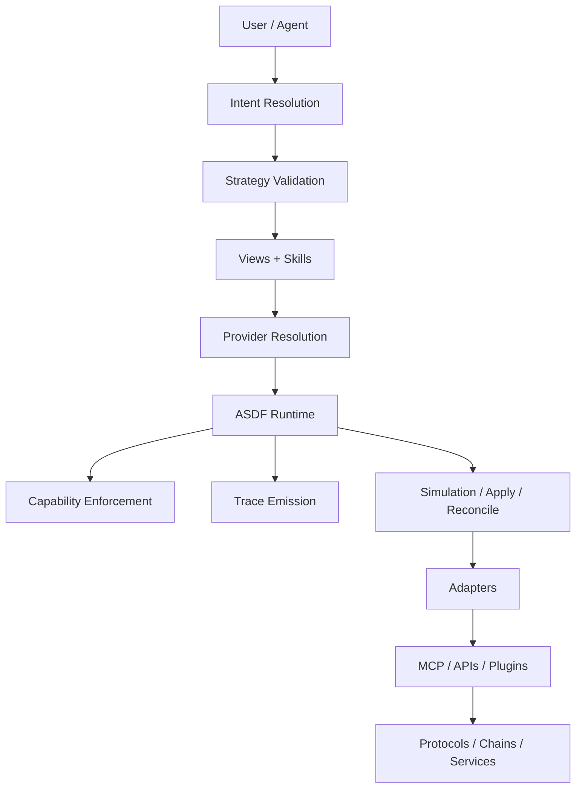

# ASDF‑0018
Runtime Specification

## Purpose

Defines the responsibilities, interfaces, and conformance requirements for an ASDF-compliant runtime.

A runtime is the execution environment that loads, validates, and executes ASDF artifacts. This specification formalizes the contract that any runtime must satisfy to participate in the ASDF ecosystem.

## Motivation

ASDF defines a family of specifications covering intents, strategies, skills, views, providers, managed resources, and traces. These specifications describe *what* can be expressed, but they do not define *what a runtime must do* to execute them.

Without a runtime specification:

- portability across execution environments is undefined
- conformance cannot be verified
- interoperability between runtimes is not guaranteed

This specification makes ASDF portable across environments such as UluOS, local CLIs, server runtimes, enterprise runtimes, and embedded runtimes.

## Architecture



The runtime sits at the center of the ASDF execution stack. It receives resolved strategies, enforces capabilities, dispatches to adapters, emits traces, and optionally supports simulation and reconciliation.

## Role of an ASDF Runtime

An ASDF runtime is responsible for:

- Loading and parsing ASDF artifacts (strategies, skills, views, intents, resources)
- Validating strategies before execution
- Resolving providers to concrete implementations
- Executing views (read-only queries) and skills (state-changing actions)
- Enforcing capability policies before each execution step
- Supporting simulation mode for dry-run validation
- Reconciling managed resources against desired state
- Emitting structured execution traces

## Required Interfaces

A conformant ASDF runtime must implement the following interfaces:

### Strategy Execution

```
validate_strategy(strategy) -> validation_report
```

Parse and validate a strategy definition. Return a report indicating whether the strategy is well-formed, all referenced skills and views exist, and all capabilities can be satisfied.

```
execute_strategy(strategy, inputs) -> result
```

Execute a validated strategy with the given inputs. Return the execution result including outputs and success/failure status.

### View Execution

```
execute_view(view, inputs) -> outputs
```

Invoke a state view with the given inputs (ASDF‑0011). Return typed outputs. Views must not produce side effects.

### Skill Execution

```
execute_skill(skill, inputs) -> outputs
```

Invoke a skill with the given inputs (ASDF‑0007). Return typed outputs. The runtime must verify capabilities before execution.

### Provider Resolution

```
resolve_provider(provider, context) -> implementation
```

Map a logical provider and action to a concrete adapter and method (ASDF‑0010). Context may include network, environment, or runtime-specific parameters.

### Capability Enforcement

```
enforce_capabilities(capabilities, policy) -> decision
```

Verify that all required capabilities are approved under the active policy (ASDF‑0008). Return an approval or denial decision. Execution must not proceed if any capability is denied.

### Trace Emission

```
emit_trace(execution) -> trace_document
```

Produce a structured execution trace (ASDF‑0017) capturing the full lifecycle of the execution including intent resolution, strategy selection, view queries, skill invocations, provider resolutions, and results.

## Optional Interfaces

A runtime may additionally implement:

### Intent Resolution

```
resolve_intent(intent, inputs) -> strategy
```

Map a high-level intent to a concrete strategy (ASDF‑0012). May use template or registry-based resolution.

### Simulation

```
simulate(strategy, inputs) -> plan
```

Execute a strategy in simulation mode. Views return live data but skills are not applied. The runtime produces a plan showing what would happen without making changes.

### Managed Resource Reconciliation

```
reconcile(resource) -> reconciliation_result
```

Observe current state, detect drift from desired state, and execute reconciliation strategies (ASDF‑0016). Return the reconciliation outcome.

### Stream Composition

```
execute_pipe(pipe, inputs) -> result
```

Execute a pipe chain with typed stream transforms (ASDF‑0015).

### Registry Discovery

```
registry_query(query) -> capabilities
```

Query one or more registries for available skills, views, strategies, intents, or providers (ASDF‑0013).

### Authority Resolution

```
resolve_authority(uri) -> definition
```

Resolve an authority-based ASDF URI to a capability definition (ASDF‑0014).

## Conformance Levels

### Level 1: Core

A runtime at this level can execute strategies, views, and skills with provider resolution and capability enforcement.

| Requirement | Specification |
|-------------|---------------|
| Strategy parsing and validation | ASDF‑0006 |
| View execution | ASDF‑0011 |
| Skill execution | ASDF‑0007 |
| Provider resolution | ASDF‑0010 |
| Capability enforcement | ASDF‑0008 |
| Trace emission | ASDF‑0017 |

### Level 2: Extended

A runtime at this level adds intent resolution, stream composition, and registry support.

| Requirement | Specification |
|-------------|---------------|
| All Level 1 requirements | — |
| Intent resolution | ASDF‑0012 |
| Stream composition | ASDF‑0015 |
| Registry discovery | ASDF‑0013 |

### Level 3: Full

A runtime at this level supports the complete ASDF specification set including managed resources, authority resolution, and simulation.

| Requirement | Specification |
|-------------|---------------|
| All Level 2 requirements | — |
| Managed resource reconciliation | ASDF‑0016 |
| Authority resolution | ASDF‑0014 |
| Simulation mode | — |
| MCP binding support | ASDF‑0009 |

## Runtime Portability

Different runtimes may implement ASDF differently as long as they preserve the semantics defined by each specification. The same strategy must produce the same result across conformant runtimes given the same inputs, provider mappings, and state.

### Runtime Examples

| Runtime | Type | Description |
|---------|------|-------------|
| UluOS | MCP-backed | Full runtime with MCP adapters for blockchain protocols |
| Local CLI | File-based | Lightweight runtime for development and testing |
| Server runtime | Cloud-hosted | Scalable runtime for production workloads |
| Enterprise runtime | Controlled | Organization-scoped runtime with policy enforcement |
| Embedded runtime | Minimal | Core-level runtime embedded in applications |

Runtimes declare their conformance level. Consumers of ASDF artifacts can verify compatibility by checking the runtime's declared level against the requirements of their strategies.

## UluOS as Reference Runtime

UluOS serves as a reference implementation of an ASDF runtime at Level 3 (Full). It provides:

- Orchestration of intents, strategies, views, and skills
- Provider resolution with MCP-backed adapters
- Capability enforcement via user-approved policies
- Managed resource reconciliation
- Execution trace emission
- Stream composition and pipe execution

UluOS connects to execution backends through MCP adapters such as UluWalletMCP, UluBroadcastMCP, UluCoreMCP, UluVoiMCP, UluAlgorandMCP, and UluDorkFiMCP.

Other runtimes are not required to use MCP. The adapter layer is implementation-specific.

## Execution Guarantees

Conformant runtimes must provide the following guarantees:

| Guarantee | Description |
|-----------|-------------|
| Deterministic strategy execution | Same inputs and state produce same outputs. |
| Capability enforcement before execution | No skill or view executes without approved capabilities. |
| Atomic strategy steps | Each step either completes fully or fails. Partial step execution is not permitted. |
| Trace completeness | Traces must capture all executed steps, including failures. |
| View isolation | Views must not produce side effects. |

## Error Handling

Runtimes must handle errors according to the error conditions defined in each specification. When a step fails:

1. The error must be recorded in the execution trace.
2. Strategy execution must halt unless the strategy defines error handling.
3. The runtime must return a result indicating failure with error details.

Runtimes must not silently swallow errors or continue execution after an unhandled failure.

## Error Conditions

| Condition | Behavior |
|-----------|----------|
| Strategy validation fails | Reject execution before it begins |
| Provider not resolvable | Provider resolution error |
| Capability denied | Halt execution with capability denial |
| View or skill execution fails | Record error in trace; halt strategy |
| Trace emission fails | Runtime warning; execution result still returned |
| Conformance level insufficient for artifact | Reject with unsupported feature error |

## Status

Draft
